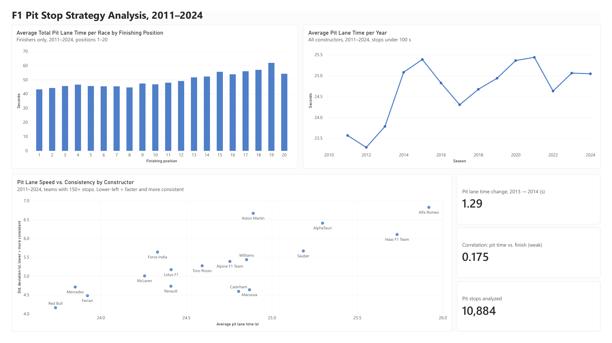

# F1 Pit Stop Strategy Analysis (2011–2024)

SQL and Power BI analysis of 10,884 Formula 1 pit stops, looking at whether pit lane time relates to finishing position, how it changed by season, and which constructors lag on speed vs. consistency.

## Business question

Does pit stop speed correlate with race finishing position, and have pit stop times changed over the years?

Full requirements, scope decisions, and limitations are in [`requirements_doc.md`](requirements_doc.md).

## Key findings

- **Pit lane time has only a weak link to finishing position.** Correlation with finishing position is +0.135 for a single stop, +0.142 for average stop time per race, and +0.175 for total pit lane time per race. P1 finishers averaged 43.2 s of total pit lane time per race, compared with 57.0 s for P18. The pattern is real but weak, and faster cars and faster crews tend to belong to the same teams, so pit time alone doesn't explain results.
- **Pit lane times did not get faster over the period.** The largest year-over-year change was 2013 to 2014, an increase of 1.29 s (1,295 ms) per stop. Season averages ranged from 23.3 s (2012) to 25.4 s (2021), with no steady improvement after 2014.
- **Red Bull was both the fastest and the most consistent constructor** (23.74 s average, 4.16 s standard deviation). **Alfa Romeo was the slowest and least consistent** (25.92 s, 6.83 s).
- **Slow and inconsistent are different problems.** Aston Martin was mid-pack on speed (24.89 s) but had the second-highest variability (6.67 s), which points to a consistency issue rather than a raw-speed one.

## Dashboard



The dashboard has three visuals and three headline cards:

1. Average total pit lane time per race by finishing position (positions 1–20)
2. Average pit lane time per season
3. Constructor speed vs. consistency (average vs. standard deviation)
4. Cards: pit stops analyzed, correlation, and the 2013 to 2014 change

Every value on the dashboard was cross-checked against the SQL results.

## Approach

1. **Requirements first.** Wrote the business question, audience, and definition of done before any code.
2. **Load.** Created six tables in PostgreSQL (`drivers`, `constructors`, `races`, `results`, `pit_stops`, `circuits`) and loaded the Kaggle CSVs with `\copy`.
3. **Analyze in SQL.** Joined pit stops to results, races, and constructors; filtered out stops of 100 s or longer (red-flag and safety-car artifacts); and computed correlations, per-constructor and per-season statistics.
4. **Views for Power BI.** Saved three views so the dashboard reads the same logic as the analysis.
5. **Dashboard.** Connected Power BI Desktop directly to PostgreSQL (Import mode) and built the visuals with DAX measures.

## SQL highlights

All queries are in [`SQL/analysis.sql`](SQL/analysis.sql).

- Multi-table joins across `pit_stops`, `results`, `races`, and `constructors` on composite keys (driver + race)
- `CORR()` for pit time vs. finishing position at three levels: single stop, average per race, and total per race
- Subqueries that aggregate stops to one row per driver per race before correlating
- `AVG()` and `STDDEV()` by constructor and by season, with a `HAVING` threshold based on a natural gap in stop counts
- Window function (`LAG`) to calculate year-over-year change
- Three views feeding Power BI: per constructor per year, per driver per race, and full-window per constructor

## Power BI highlights

- Direct PostgreSQL connection in Import mode
- DAX measures, including a **weighted average** (`SUMX`) so seasonal averages aren't distorted by averaging team averages
- A hand-written **Pearson correlation** in DAX, matching Postgres `CORR()` exactly (0.175)
- `CALCULATE` to compute the 2013 to 2014 change from the same weighted measure
- Visual-level filter excluding positions 21–24 (only possible in seasons with grids over 20 cars; 1–26 rows each)

## Repo contents

| Path | Contents |
|---|---|
| `requirements_doc.md` | Business question, definition of done, scope change, limitations |
| `SQL/analysis.sql` | Table definitions, analysis queries, and Power BI views |
| `PowerBi/f1_pit_stops.pbix` | Power BI dashboard file |
| `PowerBi/f1_pit_stops.pdf` | PDF export of the dashboard |
| `Images/dashboard.png` | Dashboard screenshot |

## How to reproduce

1. Download the **Formula 1 World Championship** dataset by Rohan Rao from Kaggle: https://www.kaggle.com/datasets/rohanrao/formula-1-world-championship-1950-2020
2. Create a PostgreSQL database named `f1`.
3. Create the tables (definitions for `drivers`, `races`, and `results` are at the top of `analysis.sql`; `pit_stops`, `constructors`, and `circuits` follow their CSV columns).
4. Load each CSV with `\copy`, using `NULL '\N'` because the dataset marks missing values as `\N`. Example:
   ```sql
   \copy pit_stops FROM 'path/to/pit_stops.csv' WITH (FORMAT csv, HEADER true, NULL '\N');
   ```
5. Run the queries and the three `CREATE VIEW` statements in `analysis.sql`.
6. Open `PowerBi/f1_pit_stops.pbix`, update the PostgreSQL connection (server `localhost`, database `f1`) if prompted, and click **Refresh**.

## Limitations

The main ones: pit lane time measures pit entry to exit, so it also reflects pit lane length and each season's calendar, not just crew speed; the correlation is weak and not causal; and constructor renames (e.g., Toro Rosso and AlphaTauri) are kept as separate teams. The full list of seven is in [`requirements_doc.md`](requirements_doc.md#limitations).

## Tools

PostgreSQL 18, psql, Power BI Desktop (DAX), Git
